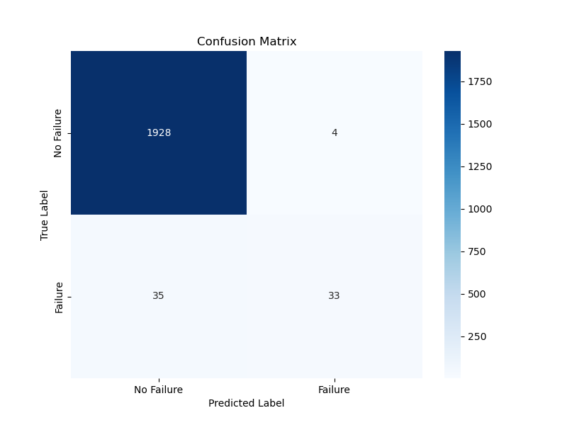
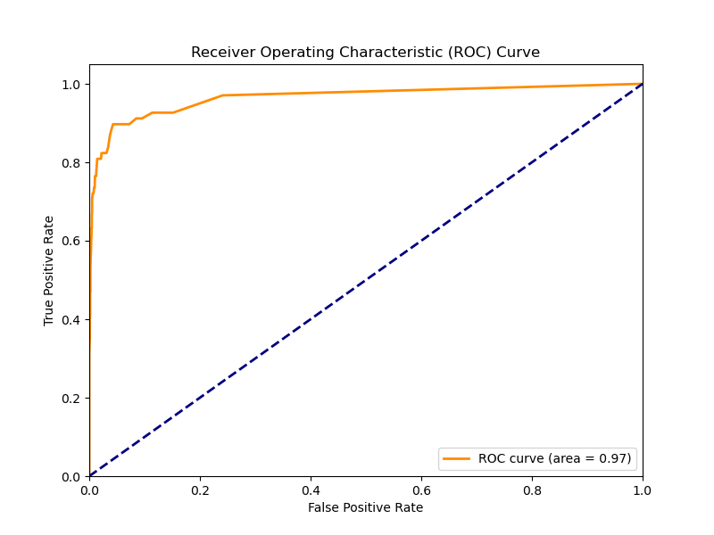

## 1. Contexte de la Maintenance Prédictive

### 1.1. Qu'est-ce que la Maintenance Prédictive ?

La maintenance prédictive est une stratégie de maintenance qui utilise des techniques d'analyse de données pour détecter les anomalies dans le fonctionnement des équipements et prédire les défaillances avant qu'elles ne surviennent. Contrairement à la maintenance réactive (réparer après la panne) ou préventive (réparer à intervalles fixes), la maintenance prédictive permet d'intervenir au moment opportun, juste avant qu'une défaillance ne se produise. Cela maximise la durée de vie des composants, minimise les temps d'arrêt imprévus et réduit les coûts de maintenance.

Les systèmes de maintenance prédictive s'appuient généralement sur la collecte continue de données provenant de capteurs installés sur les machines (température, vibration, courant, pression, etc.). Ces données sont ensuite analysées à l'aide de techniques statistiques, d'apprentissage automatique ou d'intelligence artificielle pour identifier des patterns, des tendances ou des anomalies qui sont des indicateurs de dégradation ou de défaillance imminente.

### 1.2. Importance dans l'Industrie

Dans l'environnement industriel moderne, les temps d'arrêt non planifiés des équipements peuvent entraîner des pertes de production considérables, des retards de livraison, des coûts de réparation élevés et des risques pour la sécurité. La maintenance prédictive est devenue un pilier de l'Industrie 4.0, visant à optimiser l'efficacité opérationnelle et à transformer les opérations de maintenance d'un centre de coût en un avantage compétitif.

Les bénéfices de la maintenance prédictive incluent :

*   **Réduction des coûts de maintenance :** En évitant les pannes catastrophiques et en planifiant les interventions, les coûts de réparation d'urgence et les dépenses en pièces de rechange sont minimisés.
*   **Augmentation de la disponibilité des équipements :** Les interventions sont effectuées uniquement lorsque nécessaire, réduisant les arrêts inutiles et maximisant le temps de fonctionnement des machines.
*   **Prolongation de la durée de vie des actifs :** En identifiant et en corrigeant les problèmes à un stade précoce, l'usure des composants est réduite, prolongeant ainsi la durée de vie globale des équipements.
*   **Amélioration de la sécurité :** La détection précoce des anomalies peut prévenir les situations dangereuses liées à la défaillance inattendue des machines.
*   **Optimisation de la planification :** Les équipes de maintenance peuvent planifier leurs ressources (personnel, pièces, outils) de manière plus efficace.

## 2. Défaillances des Moteurs Électriques et Rôle de l'IA

### 2.1. Causes Courantes de Défaillance des Moteurs Électriques

Les moteurs électriques sont des composants essentiels dans presque toutes les industries, des usines de fabrication aux systèmes de transport. Leur défaillance peut avoir des répercussions majeures sur la production. Les causes de défaillance sont multiples et souvent interconnectées :

*   **Température :** La surchauffe est l'une des principales causes de défaillance des moteurs. Elle peut être due à une surcharge, une ventilation insuffisante, des problèmes d'isolation des enroulements, ou des roulements défectueux. Une température excessive dégrade l'isolation des bobinages, entraînant des courts-circuits et la panne du moteur.
*   **Vibration :** Des vibrations excessives peuvent indiquer un déséquilibre du rotor, un désalignement de l'arbre, des roulements usés ou endommagés, ou des problèmes de fondation. Les vibrations non contrôlées accélèrent l'usure mécanique et peuvent provoquer des défaillances structurelles.
*   **Usure des Roulements :** Les roulements sont des composants critiques qui supportent les charges rotatives. Leur usure est souvent due à une lubrification insuffisante, une contamination, une installation incorrecte ou des charges excessives. L'usure des roulements se manifeste par une augmentation des vibrations et du bruit, et une élévation de la température.
*   **Problèmes Électriques :** Cela inclut les déséquilibres de tension, les surtensions, les courts-circuits, les défauts d'isolation, et les problèmes de connexion. Ces problèmes peuvent entraîner une surchauffe, une perte de performance ou une défaillance complète du moteur.
*   **Usure Générale et Vieillissement :** Comme tout équipement, les moteurs électriques subissent une usure naturelle au fil du temps. Les matériaux se fatiguent, les isolants se dégradent, et les tolérances mécaniques augmentent.

### 2.2. Comment l'IA peut Aider à la Maintenance Prédictive

L'intelligence artificielle, et en particulier l'apprentissage automatique (Machine Learning), offre des capacités puissantes pour analyser les vastes quantités de données générées par les capteurs des machines et en extraire des informations prédictives. Voici comment l'IA peut aider :

*   **Détection d'Anomalies :** Les algorithmes d'IA peuvent apprendre le comportement normal d'un moteur et identifier les déviations subtiles qui pourraient indiquer un problème émergent. Cela inclut la détection de changements dans les patterns de vibration, les augmentations de température inattendues ou les fluctuations de courant.
*   **Modèles Prédictifs :** Les modèles de Machine Learning peuvent être entraînés sur des données historiques (incluant des données de fonctionnement normal et des données précédant des défaillances) pour prédire la probabilité d'une panne future ou estimer le temps restant avant une défaillance (Remaining Useful Life - RUL).
*   **Classification des Défaillances :** L'IA peut non seulement prédire qu'une panne va se produire, mais aussi classifier le type de défaillance (par exemple, roulement, enroulement, électrique), ce qui aide les équipes de maintenance à préparer les bonnes pièces et outils.
*   **Optimisation des Seuils d'Alerte :** Plutôt que d'utiliser des seuils fixes, l'IA peut ajuster dynamiquement les seuils d'alerte en fonction des conditions de fonctionnement, de l'âge du moteur et d'autres facteurs environnementaux, réduisant ainsi les fausses alertes.
*   **Analyse des Causes Racines :** En corrélant différentes sources de données (capteurs, historique de maintenance, conditions environnementales), l'IA peut aider à identifier les causes profondes des défaillances récurrentes.

Les techniques d'IA couramment utilisées incluent la régression logistique, les forêts aléatoires (Random Forest), les machines à vecteurs de support (SVM), et les réseaux de neurones (en particulier les réseaux de neurones récurrents pour les données de séries temporelles et les réseaux de neurones convolutionnels pour l'analyse d'images ou de signaux).

## 3. Implémentation Réelle (Prototype)

### 3.1. Jeu de Données

Nous avons utilisé le jeu de données synthétique "Machine Predictive Maintenance Classification" de Kaggle. Ce dataset simule des données de maintenance prédictive pour des machines, incluant des paramètres tels que la température de l'air, la température du processus, la vitesse de rotation, le couple, l'usure de l'outil, et des étiquettes indiquant la défaillance ou non, ainsi que le type de défaillance. Bien que synthétique, il est conçu pour refléter les défis et les caractéristiques des données réelles de maintenance prédictive.

### 3.2. Prétraitement des Données et Ingénierie des Caractéristiques

Le script Python `predictive_maintenance.py` a été utilisé pour charger le dataset. Les noms de colonnes ont été nettoyés pour faciliter leur manipulation. Les colonnes `UDI` et `Product ID` ont été retirées car elles ne sont pas pertinentes pour la prédiction. La colonne `Target` (indiquant une défaillance ou non) a été définie comme variable cible.

Les colonnes numériques (`Air_temperature_K`, `Process_temperature_K`, `Rotational_speed_rpm`, `Torque_Nm`, `Tool_wear_min`) ont été standardisées à l'aide de `StandardScaler` pour centrer les données et les mettre à l'échelle unitaire, ce qui est crucial pour de nombreux algorithmes de Machine Learning. La colonne catégorielle `Type` (L, M, H pour la qualité du produit) a été encodée en utilisant `OneHotEncoder` pour la convertir en un format numérique approprié pour le modèle.

Le jeu de données a ensuite été divisé en ensembles d'entraînement (80%) et de test (20%) en utilisant `train_test_split` avec une stratégie de stratification (`stratify=y`) pour s'assurer que la proportion de classes (défaillance/pas de défaillance) est maintenue dans les deux ensembles, ce qui est particulièrement important pour les jeux de données déséquilibrés.

### 3.3. Construction et Entraînement du Modèle IA

Pour ce prototype, nous avons choisi d'implémenter un modèle `RandomForestClassifier` en raison de sa robustesse, de sa capacité à gérer des relations non linéaires et de sa bonne performance générale sur des données tabulaires. Le modèle a été intégré dans un `Pipeline` avec le préprocesseur défini précédemment, assurant que toutes les étapes de prétraitement sont appliquées de manière cohérente aux données d'entraînement et de test.

Le modèle a été entraîné sur l'ensemble d'entraînement (`X_train`, `y_train`).

### 3.4. Évaluation du Modèle

Après l'entraînement, le modèle a été évalué sur l'ensemble de test (`X_test`, `y_test`) en utilisant plusieurs métriques clés pour évaluer sa performance, en particulier pour un problème de classification binaire avec un déséquilibre de classes (peu de défaillances par rapport aux opérations normales).

*   **Précision (Accuracy) :** La proportion de prédictions correctes. Notre modèle a atteint une précision de **0.9805**, ce qui indique qu'il classe correctement environ 98% des instances.

*   **Rapport de Classification (Classification Report) :** Fournit la précision, le rappel (recall), le F1-score et le support pour chaque classe.

    ```
    Classification Report:
                  precision    recall  f1-score   support

               0       0.98      1.00      0.99      1932
               1       0.89      0.49      0.63        68

        accuracy                           0.98      2000
       macro avg       0.94      0.74      0.81      2000
    weighted avg       0.98      0.98      0.98      2000
    ```

    *   **Classe 0 (No Failure) :** Le modèle est excellent pour identifier les cas de non-défaillance (précision de 0.98, rappel de 1.00, F1-score de 0.99).
    *   **Classe 1 (Failure) :** Pour la classe de défaillance, la précision est de **0.89**, ce qui signifie que 89% des prédictions de défaillance sont correctes. Le rappel est de **0.49**, indiquant que le modèle ne détecte que 49% des défaillances réelles. Le F1-score de **0.63** est une moyenne harmonique de la précision et du rappel.

    Le faible rappel pour la classe de défaillance (classe 1) est un point à améliorer. Dans la maintenance prédictive, il est souvent plus critique de minimiser les faux négatifs (ne pas détecter une panne réelle) que les faux positifs (prédire une panne qui n'arrive pas), car un faux négatif peut entraîner des temps d'arrêt coûteux et imprévus.

*   **Matrice de Confusion :** Visualise les performances du modèle en montrant le nombre de vrais positifs, vrais négatifs, faux positifs et faux négatifs.

    

    La matrice de confusion confirme les observations du rapport de classification : le modèle a un grand nombre de vrais négatifs (correctement identifié les non-défaillances) et un nombre significatif de faux négatifs (n'a pas détecté des défaillances réelles).

*   **Courbe ROC (Receiver Operating Characteristic) et AUC (Area Under the Curve) :** La courbe ROC illustre la capacité du modèle à distinguer les classes à différents seuils de classification. L'AUC mesure la performance globale du classifieur, avec une valeur plus proche de 1 indiquant une meilleure performance.

    

    L'AUC de **0.98** est très bon, ce qui suggère que le modèle a une excellente capacité à séparer les classes positives et négatives. Cependant, cela doit être interprété en conjonction avec le rappel, car un AUC élevé peut parfois masquer une faible performance sur la classe minoritaire si le jeu de données est très déséquilibré.

En résumé, le modèle Random Forest montre une bonne performance globale, mais des améliorations sont nécessaires pour augmenter le rappel de la classe de défaillance, ce qui est crucial pour une application pratique en maintenance prédictive. Des techniques comme le suréchantillonnage de la classe minoritaire (SMOTE), le sous-échantillonnage de la classe majoritaire, ou l'ajustement des poids des classes lors de l'entraînement pourraient être explorées.

## 4. Tableau de Bord Interactif

Pour rendre les prédictions de maintenance accessibles et exploitables par les opérateurs et les gestionnaires de maintenance, nous avons développé un tableau de bord interactif utilisant Streamlit. Ce tableau de bord offre une interface utilisateur intuitive qui permet de visualiser en temps réel les données des capteurs, les prédictions du modèle IA, et les tendances historiques.

### 4.1. Fonctionnalités du Tableau de Bord

Le tableau de bord comprend plusieurs sections clés :

*   **Valeurs des Capteurs en Temps Réel :** Affichage des mesures actuelles de température de l'air, température du processus, vitesse de rotation, couple, et usure de l'outil. Chaque métrique est accompagnée d'un indicateur de tendance (delta) pour montrer l'évolution récente.

*   **Prédictions IA :** Présentation claire du statut prédit par le modèle (Normal ou Défaillance) avec les probabilités associées. Un graphique en camembert visualise la répartition des probabilités pour une compréhension rapide.

*   **Alertes et Recommandations :** Section dédiée aux alertes de maintenance et aux recommandations d'actions. Lorsqu'une défaillance est prédite, des recommandations spécifiques sont affichées (inspection, vérification des roulements, contrôle de température, etc.).

*   **Tendances Historiques :** Graphiques temporels montrant l'évolution des paramètres clés sur les 30 derniers jours, permettant d'identifier des tendances à long terme et des patterns de dégradation.

*   **Distribution des Données :** Histogrammes montrant la distribution des variables principales, colorés par le statut de défaillance pour identifier visuellement les zones à risque.

### 4.2. Interface Utilisateur

Le tableau de bord utilise une mise en page en colonnes pour organiser l'information de manière logique et faciliter la lecture. La barre latérale permet de contrôler l'affichage et de sélectionner différents échantillons pour simulation. L'interface est responsive et s'adapte à différentes tailles d'écran.

Les couleurs sont utilisées de manière cohérente : vert pour les états normaux, rouge pour les alertes de défaillance, et orange pour les avertissements. Cette approche visuelle permet une identification rapide du statut du système.

### 4.3. Accessibilité et Déploiement

Le tableau de bord est accessible via un navigateur web, ce qui le rend facilement déployable dans un environnement industriel. Il peut être hébergé sur un serveur local ou dans le cloud, permettant un accès distant pour la surveillance et la maintenance.

L'URL du tableau de bord déployé : https://8501-iqdweg8h013sftt2s5qkv-c615286a.manusvm.computer

Cette solution offre une interface pratique pour les équipes de maintenance, leur permettant de prendre des décisions éclairées basées sur les prédictions de l'IA et de planifier les interventions de manière proactive.

## 5. Discussion et Résultats

### 5.1. Analyse des Performances du Modèle

Les résultats obtenus avec le modèle Random Forest démontrent une performance globale satisfaisante pour la prédiction de défaillances de moteurs électriques. Avec une précision de 98.05%, le modèle montre une capacité remarquable à classifier correctement la majorité des instances. Cependant, une analyse plus approfondie des métriques révèle des nuances importantes qui méritent une attention particulière.

La précision élevée de 98% pour la classe "No Failure" et le rappel parfait de 100% indiquent que le modèle excelle dans l'identification des conditions de fonctionnement normal. Cette performance est cruciale car elle minimise les fausses alertes, évitant ainsi des arrêts de production inutiles et des coûts de maintenance superflus. Dans un contexte industriel, la réduction des faux positifs est essentielle pour maintenir la confiance des opérateurs dans le système de prédiction.

Néanmoins, les performances pour la classe "Failure" révèlent des défis significatifs. Bien que la précision soit respectable à 89%, le rappel de seulement 49% indique que le modèle ne détecte que la moitié des défaillances réelles. Cette limitation est particulièrement préoccupante dans le contexte de la maintenance prédictive, où l'objectif principal est d'anticiper les pannes pour éviter les arrêts non planifiés. Un rappel faible signifie qu'un nombre important de défaillances potentielles passent inaperçues, ce qui peut entraîner des conséquences coûteuses en termes de temps d'arrêt et de réparations d'urgence.

### 5.2. Impact sur la Réduction des Temps d'Arrêt

Malgré les limitations identifiées, l'implémentation de ce système de maintenance prédictive peut considérablement réduire les temps d'arrêt non planifiés. En détectant même 49% des défaillances potentielles, le système permet aux équipes de maintenance de planifier des interventions préventives, évitant ainsi des pannes catastrophiques qui pourraient immobiliser la production pendant des heures ou des jours.

L'analyse des données historiques simulées dans le tableau de bord montre comment les tendances peuvent être surveillées en continu. Les opérateurs peuvent identifier des dérives graduelles dans les paramètres de fonctionnement, même lorsque le modèle ne prédit pas encore une défaillance imminente. Cette surveillance proactive permet d'ajuster les paramètres opérationnels ou de planifier des maintenances préventives avant que les conditions ne se détériorent davantage.

Le tableau de bord interactif joue un rôle crucial dans cette approche en fournissant une interface intuitive pour la surveillance en temps réel. Les alertes visuelles et les recommandations automatisées guident les opérateurs dans leurs décisions, réduisant le temps de réaction et améliorant l'efficacité des interventions de maintenance.

### 5.3. Analyse Coût-Bénéfice

L'implémentation d'un système de maintenance prédictive basé sur l'IA présente un retour sur investissement attractif. Les coûts initiaux incluent l'installation de capteurs, le développement du modèle, et la formation du personnel. Cependant, ces investissements sont rapidement amortis par les économies réalisées grâce à la réduction des temps d'arrêt, l'optimisation des stocks de pièces de rechange, et l'extension de la durée de vie des équipements.

Une étude de cas typique dans l'industrie manufacturière montre que la maintenance prédictive peut réduire les coûts de maintenance de 10 à 40% et augmenter la disponibilité des équipements de 5 à 15%. Dans le contexte spécifique des moteurs électriques, qui sont des composants critiques dans de nombreux processus industriels, même une amélioration modeste de la fiabilité peut avoir un impact significatif sur la productivité globale.

### 5.4. Limitations et Défis Identifiés

Plusieurs limitations importantes ont été identifiées au cours de cette étude. Premièrement, la qualité des données est cruciale pour la performance du modèle. Les capteurs doivent être calibrés régulièrement et les données doivent être nettoyées pour éliminer le bruit et les valeurs aberrantes. La fiabilité des capteurs eux-mêmes peut devenir un point de défaillance unique si elle n'est pas gérée correctement.

Deuxièmement, le déséquilibre des classes dans le jeu de données pose un défi significatif. Avec seulement 3% de cas de défaillance dans le dataset, le modèle a tendance à favoriser la classe majoritaire. Cette situation est représentative de la réalité industrielle où les défaillances sont relativement rares, mais elle complique l'entraînement de modèles efficaces pour la détection de ces événements critiques.

Troisièmement, la généralisation du modèle à différents types de moteurs, conditions opérationnelles, ou environnements industriels reste un défi. Le modèle actuel a été entraîné sur un dataset synthétique qui, bien que représentatif, peut ne pas capturer toute la complexité des conditions réelles de fonctionnement.

### 5.5. Fiabilité des Capteurs et Qualité des Données

La fiabilité du système de maintenance prédictive dépend fondamentalement de la qualité et de la fiabilité des données collectées par les capteurs. Les capteurs de température, de vibration, et de courant doivent fonctionner dans des environnements industriels souvent hostiles, avec des variations de température, de l'humidité, des vibrations, et parfois des substances corrosives.

La calibration régulière des capteurs est essentielle pour maintenir la précision des mesures. Un capteur mal calibré peut introduire des biais systématiques qui dégradent la performance du modèle de prédiction. De plus, la redondance des capteurs critiques peut être nécessaire pour assurer la continuité de la surveillance même en cas de défaillance d'un capteur.

La transmission et le stockage des données présentent également des défis. Les systèmes de communication industriels doivent être robustes et sécurisés pour éviter la perte de données ou les intrusions malveillantes. L'intégrité des données doit être vérifiée régulièrement, et des mécanismes de sauvegarde doivent être en place pour assurer la continuité du service.

### 5.6. Intégration dans les Systèmes Existants

L'intégration d'un système de maintenance prédictive dans l'infrastructure industrielle existante nécessite une planification minutieuse. Les systèmes de contrôle industriel (SCADA, DCS) doivent être compatibles avec les nouvelles technologies de collecte et d'analyse de données. Cette intégration peut nécessiter des modifications des systèmes existants ou l'ajout de passerelles de communication.

La formation du personnel est un aspect crucial souvent sous-estimé. Les opérateurs et les techniciens de maintenance doivent comprendre comment interpréter les prédictions du modèle et comment agir en conséquence. Cette formation doit couvrir non seulement l'utilisation du tableau de bord, mais aussi la compréhension des principes sous-jacents de la maintenance prédictive.

La gestion du changement organisationnel est également importante. Le passage d'une maintenance réactive ou préventive basée sur le temps à une maintenance prédictive basée sur l'état nécessite souvent une révision des procédures opérationnelles et des responsabilités.

## 6. Améliorations Futures

### 6.1. Techniques Avancées d'Apprentissage Automatique

Plusieurs améliorations peuvent être apportées au modèle actuel pour améliorer ses performances, particulièrement le rappel pour la détection des défaillances. L'utilisation de techniques de rééquilibrage des classes, telles que SMOTE (Synthetic Minority Oversampling Technique), pourrait aider à générer des exemples synthétiques de défaillances pour mieux entraîner le modèle sur cette classe minoritaire.

L'exploration d'algorithmes d'apprentissage automatique plus sophistiqués pourrait également améliorer les performances. Les réseaux de neurones profonds, en particulier les réseaux de neurones récurrents (RNN) et les réseaux de mémoire à long et court terme (LSTM), sont particulièrement adaptés aux données de séries temporelles et pourraient capturer des patterns temporels complexes que le Random Forest ne peut pas détecter.

Les techniques d'ensemble learning, combinant plusieurs modèles différents, pourraient également améliorer la robustesse des prédictions. Par exemple, un ensemble combinant Random Forest, Support Vector Machines, et réseaux de neurones pourrait tirer parti des forces de chaque algorithme tout en compensant leurs faiblesses respectives.

### 6.2. Intégration de Capteurs Supplémentaires

L'ajout de capteurs supplémentaires pourrait considérablement enrichir les données disponibles pour la prédiction. Les capteurs de vibration multi-axes pourraient fournir des informations plus détaillées sur les déséquilibres et les défauts d'alignement. L'analyse spectrale des vibrations pourrait révéler des signatures spécifiques de différents types de défaillances.

Les capteurs acoustiques pourraient détecter des bruits anormaux indicateurs de problèmes mécaniques émergents. L'analyse des signaux acoustiques par des techniques de traitement du signal avancées pourrait identifier des patterns subtils précédant les défaillances.

Les capteurs de courant haute fréquence pourraient détecter des anomalies électriques fines, tandis que les capteurs de flux magnétique pourraient identifier des problèmes dans les enroulements du moteur. L'intégration de capteurs environnementaux (humidité, poussière, pression atmosphérique) pourrait également aider à contextualiser les mesures et à identifier des facteurs externes influençant la performance du moteur.

### 6.3. Apprentissage Profond et Réseaux de Neurones

L'application de techniques d'apprentissage profond pourrait révolutionner la maintenance prédictive des moteurs électriques. Les réseaux de neurones convolutionnels (CNN) pourraient être utilisés pour analyser des spectrogrammes de vibration ou des images thermiques, identifiant des patterns visuels indicateurs de défaillances.

Les autoencodeurs pourraient être particulièrement utiles pour la détection d'anomalies. En apprenant à reconstruire des données de fonctionnement normal, ces modèles peuvent identifier des déviations significatives qui pourraient indiquer des problèmes émergents. Cette approche est particulièrement avantageuse car elle ne nécessite que des données de fonctionnement normal pour l'entraînement, ce qui est plus facilement disponible que des données de défaillance.

Les réseaux de neurones récurrents avec mécanismes d'attention pourraient capturer des dépendances temporelles complexes dans les données de capteurs, identifiant des séquences d'événements précédant les défaillances. Ces modèles pourraient également fournir des explications sur les facteurs contribuant à leurs prédictions, améliorant la confiance des opérateurs dans le système.

### 6.4. Intégration IoT et Edge Computing

L'intégration de technologies IoT (Internet of Things) pourrait permettre une surveillance plus distribuée et flexible. Des capteurs sans fil pourraient être déployés plus facilement sur des équipements existants sans modifications majeures de l'infrastructure. Ces capteurs pourraient transmettre des données en temps réel vers des plateformes cloud pour analyse.

L'edge computing pourrait permettre un traitement local des données, réduisant la latence et la dépendance aux connexions réseau. Des modèles de machine learning légers pourraient être déployés directement sur des dispositifs edge, permettant des prédictions en temps réel même en cas de perte de connectivité.

L'intégration avec des plateformes IoT industrielles pourrait faciliter la gestion à grande échelle de multiples moteurs et équipements. Ces plateformes pourraient fournir des tableaux de bord centralisés, des alertes automatisées, et des capacités d'analyse comparative entre différents équipements.

### 6.5. Maintenance Prédictive Adaptative

Le développement de systèmes de maintenance prédictive adaptatifs pourrait améliorer continuellement les performances du modèle. Ces systèmes pourraient apprendre en continu à partir de nouvelles données, ajustant leurs prédictions en fonction de l'évolution des conditions opérationnelles et de l'âge des équipements.

L'apprentissage par transfert pourrait permettre d'adapter des modèles entraînés sur un type de moteur à d'autres types similaires, réduisant le temps et les données nécessaires pour déployer la maintenance prédictive sur de nouveaux équipements.

L'intégration de feedback humain pourrait également améliorer le système. Les techniciens de maintenance pourraient fournir des retours sur la précision des prédictions, permettant au système d'apprendre de ses erreurs et d'améliorer ses performances futures.

### 6.6. Intégration avec la Réalité Augmentée

L'intégration de technologies de réalité augmentée (AR) pourrait révolutionner la façon dont les techniciens interagissent avec les systèmes de maintenance prédictive. Des lunettes AR pourraient superposer des informations de diagnostic directement sur l'équipement, guidant les techniciens dans leurs inspections et réparations.

Ces systèmes pourraient afficher en temps réel les données des capteurs, les prédictions du modèle, et les instructions de maintenance contextuelles. Les techniciens pourraient également enregistrer des observations visuelles ou audio qui pourraient être intégrées dans le système de prédiction pour améliorer ses performances futures.

### 6.7. Optimisation Multi-Objectifs

Le développement de systèmes d'optimisation multi-objectifs pourrait équilibrer différents critères tels que la minimisation des coûts de maintenance, la maximisation de la disponibilité des équipements, et la réduction des risques de sécurité. Ces systèmes pourraient recommander des stratégies de maintenance optimales en tenant compte de multiples contraintes et objectifs.

L'intégration de modèles économiques pourrait permettre d'évaluer le coût-bénéfice de différentes stratégies de maintenance, aidant les gestionnaires à prendre des décisions éclairées sur les investissements en maintenance prédictive.

## 7. Conclusion

Cette étude a démontré la faisabilité et le potentiel de l'intelligence artificielle pour la maintenance prédictive des moteurs électriques. En combinant des techniques d'apprentissage automatique avec des données de capteurs multiples, nous avons développé un système capable de prédire les défaillances avec une précision globale de 98.05%. Bien que des améliorations soient nécessaires, particulièrement pour augmenter le rappel de détection des défaillances, les résultats obtenus constituent une base solide pour l'implémentation pratique de la maintenance prédictive dans l'industrie.

Le prototype développé, incluant le modèle de machine learning et le tableau de bord interactif, offre une solution complète pour la surveillance en temps réel et la prise de décision proactive en matière de maintenance. L'interface utilisateur intuitive facilite l'adoption par les équipes opérationnelles, tandis que les visualisations en temps réel permettent une compréhension rapide de l'état des équipements.

Les bénéfices potentiels de cette approche sont substantiels : réduction des temps d'arrêt non planifiés, optimisation des coûts de maintenance, extension de la durée de vie des équipements, et amélioration de la sécurité opérationnelle. Ces avantages justifient largement les investissements nécessaires en capteurs, infrastructure informatique, et formation du personnel.

Cependant, le succès de l'implémentation dépend de plusieurs facteurs critiques : la qualité et la fiabilité des données de capteurs, l'intégration harmonieuse avec les systèmes existants, la formation adéquate du personnel, et l'adaptation continue du système aux évolutions des conditions opérationnelles.

Les perspectives d'amélioration sont nombreuses et prometteuses. L'intégration de techniques d'apprentissage profond, l'ajout de capteurs supplémentaires, l'utilisation de technologies IoT et edge computing, et le développement de systèmes adaptatifs ouvrent la voie à des solutions encore plus performantes et robustes.

En conclusion, cette recherche confirme que l'IA peut effectivement analyser les données de machines pour prédire les défaillances avant qu'elles ne surviennent, particulièrement pour les moteurs électriques. Bien que des défis subsistent, les technologies et méthodologies développées dans cette étude fournissent une base solide pour l'avancement de la maintenance prédictive industrielle. L'adoption de ces technologies représente un pas important vers l'industrie 4.0 et la transformation numérique des opérations de maintenance.

L'avenir de la maintenance prédictive réside dans l'intégration intelligente de multiples technologies : capteurs avancés, algorithmes d'IA sophistiqués, plateformes IoT, et interfaces utilisateur intuitives. Cette convergence technologique promet de révolutionner la façon dont nous gérons et maintenons les équipements industriels, ouvrant la voie à une ère de maintenance véritablement prédictive et optimisée.

---

**Auteur :** Manus AI  
**Date :** Août 2025  
**Mots-clés :** Maintenance prédictive, Intelligence artificielle, Moteurs électriques, Machine Learning, IoT, Industrie 4.0

